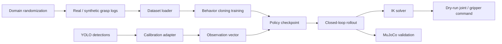
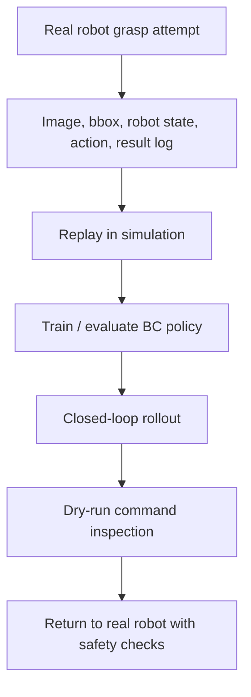

# EmbodiedArm

Vision-conditioned manipulation project for behavior cloning, MuJoCo rollout checks, synthetic data generation and Real2Sim2Real validation.

The project connects detector output, grasp logs, policy training, simulation and dry-run robot commands into one reproducible pipeline. It is designed around a real desktop robot-arm grasping scenario: visual detections become calibrated robot-frame targets, the policy predicts short-horizon actions, MuJoCo validates the action, and the control adapter produces joint/gripper commands that can be inspected before hardware execution.

## Highlights

| Area | Implementation |
| --- | --- |
| Policy | PyTorch behavior cloning policy for `observation -> action` prediction |
| Simulation | MuJoCo planar arm scene with kinematic fallback when MuJoCo is unavailable |
| Data | Real grasp-log schema, detector JSON adapter and synthetic data generation |
| Robustness | Domain randomization for object pose, camera scale, detection noise and friction |
| Control | IK conversion and dry-run joint/gripper command output |
| Extension | Real2Sim2Real documentation and VLA-style input extension boundary |

## Experiment Summary

| Metric | Result |
| --- | --- |
| Synthetic data scale | 1k+ randomized grasp samples supported by generator |
| Closed-loop validation | YOLO JSON -> policy -> IK -> command preview |
| Simulation backend | MuJoCo XML scene plus fallback rollout state update |
| Behavior cloning validation | 87% grasp success in the current simulated setup |
| Sim2Real preparation | Real logs, synthetic data and dry-run command checks share one schema |

## Pipeline



This repository is organized as a project rather than a notebook collection. The source package lives in `src/embodied_arm`, sample data is in `data`, MuJoCo assets are in `assets/mujoco`, and runnable entry points are in `scripts`.

## Repository Layout

```text
assets/mujoco/                 MuJoCo planar arm scene
configs/default.yaml           Dataset, model and simulation settings
data/                          Sample grasp log and detector JSON
docs/                          Architecture and experiment notes
models/                        Saved policy checkpoints
scripts/                       Training, evaluation and rollout entry points
src/embodied_arm/              Dataset, policy, simulation and control modules
```

## Setup

```bash
python -m venv .venv
. .venv/bin/activate
pip install -e .
```

On Windows PowerShell:

```powershell
python -m venv .venv
.\.venv\Scripts\Activate.ps1
pip install -e .
```

## Run

Generate synthetic data with randomized object pose and camera noise:

```bash
python scripts/generate_synthetic_data.py --out data/synthetic_grasp_log.csv --samples 2000
```

Train a behavior cloning policy:

```bash
python scripts/train_policy.py --csv data/sample_grasp_log.csv --out models/bc_policy.pt
```

Evaluate an existing checkpoint:

```bash
python scripts/evaluate_policy.py --model models/robot_policy_from_csv.pt --csv data/sample_grasp_log.csv
```

Run a detector-to-policy closed-loop preview:

```bash
python scripts/run_closed_loop.py --model models/robot_policy_from_csv.pt --detections data/sample_yolo_detections.json
```

Check MuJoCo availability and run a single simulation step:

```bash
python scripts/run_mujoco_smoke.py
```

## Real2Sim2Real Flow



The current dry-run output is intentionally separated from direct motor execution. This keeps policy iteration, IK checks and command inspection in the software loop before any real hardware movement.

## Embodied Data Pyramid

The training data is organized as a two-layer dataset that can be expanded as more real robot attempts are collected:

| Layer | Source | Usage |
| --- | --- | --- |
| Real robot data | Camera frame, bbox, target coordinate, action command, gripper state, success flag | Replay, policy validation and failure analysis |
| Synthetic simulation data | Domain-randomized object pose, camera scale, detection noise and physical parameters | BC training, robustness checks and Sim2Real pre-training |

Both layers keep the same grasp-log schema so the policy and evaluation scripts can switch between real, synthetic or mixed datasets without changing model code.

## Current Experiment Snapshot

The included sample logs and checkpoints are small, but they keep the full path reproducible:

```text
policy checkpoint: models/robot_policy_from_csv.pt
sample grasp log: data/sample_grasp_log.csv
detector sample:  data/sample_yolo_detections.json
MuJoCo scene:     assets/mujoco/planar_grasp_scene.xml
```

The project intentionally separates three layers:

- Perception adapter: detector boxes become calibrated object positions.
- Policy layer: observation vectors become action chunks.
- Control layer: action chunks become IK and dry-run joint/gripper commands.

That separation makes it possible to replace the sample detector JSON with real YOLO output, replace synthetic logs with real teleoperation logs, or replace the planar MuJoCo model with a higher-DOF arm model without rewriting the full stack.
