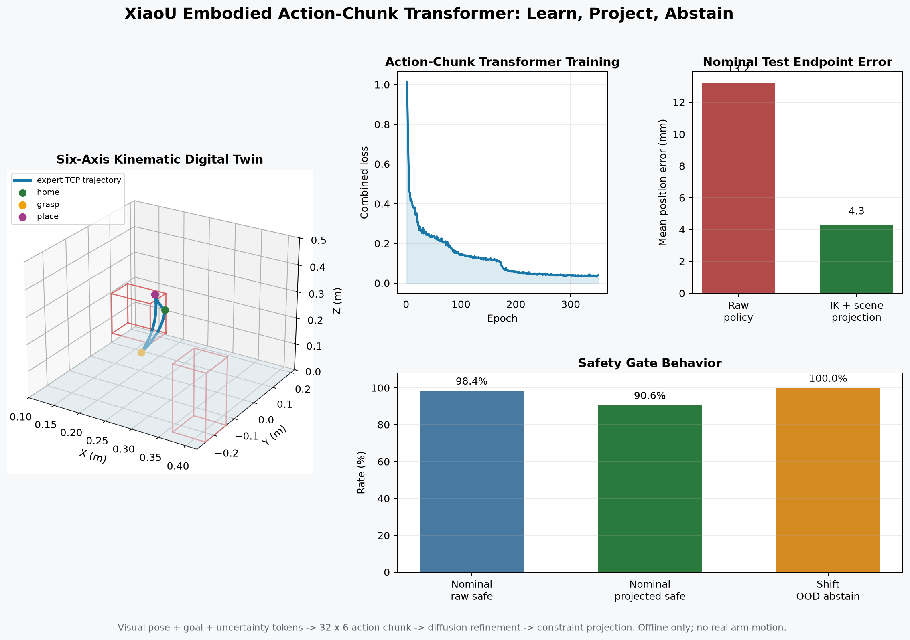
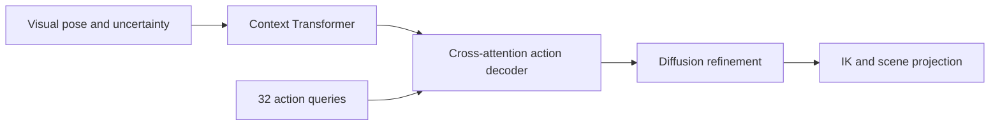

# XiaoU Embodied Action-Chunk Transformer Digital Twin

Six-axis visual grasping, coordinate planning, and safety verification project for the XiaoU desktop robot arm. The repository combines YOLO-side target handoff, planar calibration, a POE/URDF-checked kinematic model, trajectory planning, CAN/UART protocol validation, ROS 2 planning entry points, and an offline embodied action-chunk Transformer diffusion policy.



## Why this project is different

- **Counterfactual demonstrations**: creates complete home-to-grasp-to-place trajectories from the checked-in six-axis POE model, with controlled vision pose and confidence perturbations.
- **Embodied Action-Chunk Transformer**: encodes visual grasp pose, place goal, observation uncertainty, and a learned task token; a cross-attention decoder produces a complete `32 x 6` six-axis action chunk rather than one fixed endpoint action.
- **Proposal-guided diffusion policy**: the learned 32-step proposal initializes a 16-step denoising process, preserving a structured trajectory prior instead of sampling arbitrary joint-space noise.
- **Constraint projection safety shield**: uses multi-start IK, joint envelopes, TCP clearance against table/fixture keep-out boxes, and explicit failure reporting before accepting an offline plan preview.
- **Support-domain abstention**: detects visual uncertainty outside the calibrated training support and requests recheck rather than treating a low-variance prediction as safe.

The default `hidden_dim=96` model has 737,862 trainable parameters. In the checked-in offline experiment, the constraint projection reduced mean grasp endpoint error from **13.25 mm** to **4.30 mm** on a 128-episode nominal synthetic test. A higher-noise 128-episode shift test was rejected by the support gate. These are digital-twin results only, not real-arm performance claims.

This is an ACT-style action-chunk design for calibrated visual geometry, not a pretrained VLA or a claim of raw-image/language foundation-model capability.


```mermaid
flowchart LR
    V["Visual pose and uncertainty"] --> C["Context Transformer"]
    C --> A["Cross-attention action decoder"]
    Q["32 action queries"] --> A
    A --> D["Diffusion refinement"]
    D --> S["IK and scene projection"]
```

## Quick Start

Core offline verification:

```powershell
python -m unittest discover -s tests -v
python tools\verify_six_axis_stack.py
```

Reproduce the constraint-diffusion experiment with a Python environment that includes PyTorch, NumPy, and Matplotlib:

```powershell
powershell -ExecutionPolicy Bypass -File .\tools\run_constraint_diffusion.ps1
```

The workflow writes datasets, checkpoints, and reports under `runtime/`, which is intentionally ignored by Git. The publishable dashboard is stored at `assets/constraint_diffusion_dashboard.png`.

## Safety Boundary

Every simulator and evaluation tool is offline. They do not open a CAN interface, serial port, ROS 2 hardware driver, or issue real-arm motion commands. Real motion remains blocked until measured calibration, joint IDs, encoder zero offsets, directions, limits, feedback, emergency stop, full-link collision review, and explicit authorization are available.

## Documentation

- [Chinese project guide](README_使用说明.md)
- [Embodied Action-Chunk Transformer experiment note](docs/constraint_diffusion_digital_twin.md)
- [Six-axis simulation review](docs/simulation_review_20260807.md)
- [ROS 2 planning workspace](ros2_ws/)
