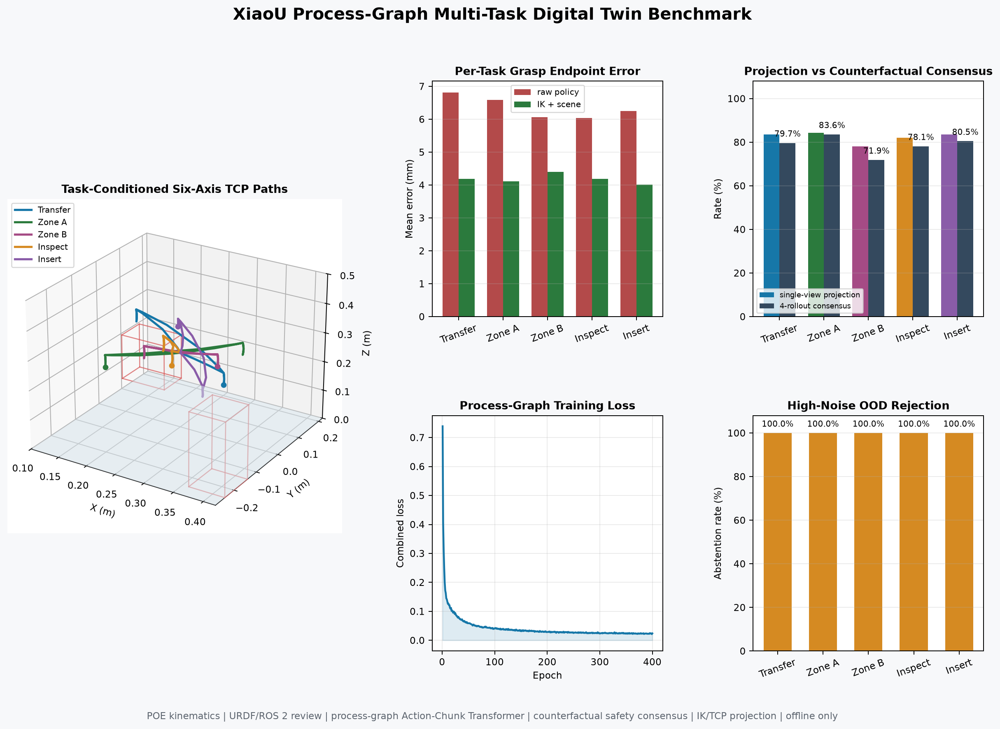
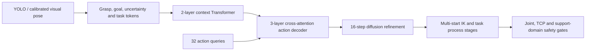

# XiaoU Multi-Task Factory-Cell Digital Twin

An offline six-axis manipulation benchmark that connects visual target handoff, task-conditioned action-chunk generation, kinematic projection, ROS 2 planning artifacts, and explicit hardware execution gates for the XiaoU desktop arm.



## Verified Capabilities

- **Five task profiles**: transfer, two simulated placement zones, two-view inspection, and precision insertion with final dwell.
- **Embodied Action-Chunk Transformer**: visual grasp pose, place goal, uncertainty metadata, a five-way task profile, and a learned task token are fused by a two-layer Transformer encoder. A three-layer cross-attention decoder produces a complete `32 x 6` joint action chunk.
- **Proposal-guided diffusion**: a learned action-chunk proposal is refined over 16 denoising steps rather than sampling an unstructured joint trajectory from noise.
- **Kinematics-grounded process stages**: each trajectory contains approach, contact, transfer, retreat, and task-specific dwell phases. Approach poses are created by Cartesian vertical offsets and solved with multi-start damped least-squares IK.
- **Safety projection and abstention**: joint envelopes, visual-support distance, sample dispersion, task-region checks, IK recovery, and TCP clearance against table/fixture keep-out boxes gate every offline preview.

## Reproducible Multi-Task Benchmark

The checked-in dashboard was generated on the local CUDA environment with a 1,320,710-parameter `hidden_dim=128` policy.

| Split | Episodes | Task balance | Visual condition |
| --- | ---: | --- | --- |
| Train | 4,096 | 820 transfer, 819 each remaining task | Per-episode domain randomization: 0.55-1.45x base noise; confidence 0.68-0.99 |
| Nominal test | 640 | 128 per task | XY 3 mm, Z 2 mm, yaw 2 deg |
| OOD test | 640 | 128 per task | XY 8 mm, Z 4 mm, yaw 5 deg |

| Nominal metric | Result |
| --- | ---: |
| Raw-policy mean grasp endpoint error | 6.62 mm |
| Constraint-projected mean grasp endpoint error | 4.18 mm |
| Projected-safe coverage across all tasks | 82.34% |
| High-noise OOD abstention across all tasks | 100.00% |

The projected-safe rate is deliberately not presented as a real-arm success rate. It is the fraction of offline episodes that pass the checked-in task, IK, and TCP scene gates after a synthetic visual observation.

## Simulation Evidence

- Six-axis POE model is checked against the ROS 2 URDF: maximum screw-axis error `3.97e-9`, maximum home-transform error `1.00e-12`.
- ROS 2 workspace includes robot description, collision/visual meshes, MoveIt configuration, perception entry points, and review-only launch paths.
- MoveIt trajectory execution and the planner execution path remain disabled until measured calibration, limits, feedback, emergency stop, and explicit authorization exist.


```mermaid
flowchart LR
    V["YOLO / calibrated visual pose"] --> C["Grasp, goal, uncertainty and task tokens"]
    C --> E["2-layer context Transformer"]
    E --> A["3-layer cross-attention action decoder"]
    Q["32 action queries"] --> A
    A --> D["16-step diffusion refinement"]
    D --> P["Multi-start IK and task process stages"]
    P --> S["Joint, TCP and support-domain safety gates"]
```

## Quick Start

Core offline verification:

```powershell
python -m unittest discover -s tests -v
python -m compileall -q robot_ai tests tools
python tools\verify_six_axis_stack.py
```

Reproduce the multi-task benchmark using a Python environment with PyTorch, NumPy, and Matplotlib:

```powershell
powershell -ExecutionPolicy Bypass -File .\tools\run_constraint_diffusion.ps1
```

Generated datasets, checkpoints, and reports remain under `runtime/` and are intentionally ignored by Git. The public benchmark dashboard is `assets/multitask_factory_cell_dashboard.png`.

## Explicit Limits

This is an ACT-style action-chunk design for calibrated visual geometry. It is not a pretrained VLA, does not consume raw RGB or language instructions, and is not a certified industrial control system. The digital twin uses the checked-in POE model and TCP-only scene review; full-link collision, calibrated camera-to-base transforms, measured encoder offsets, force feedback, and real-arm validation remain required before physical motion.

## Documentation

- [Chinese project guide](README_使用说明.md)
- [Multi-task Transformer experiment note](docs/constraint_diffusion_digital_twin.md)
- [Six-axis simulation review](docs/simulation_review_20260807.md)
- [ROS 2 planning workspace](ros2_ws/)
