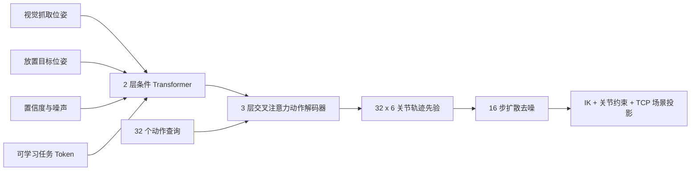

# XiaoU 六轴视觉抓取与具身 Action-Chunk Transformer 数字孪生

这是一个面向桌面六轴机械臂的离线视觉抓取与轨迹生成工程。项目把视觉坐标输入、POE/URDF 运动学核验、动作块 Transformer、扩散轨迹生成、约束投影和硬件协议门禁组织成可复现链路。默认只生成离线计划与验证报告，不会连接或驱动真实机械臂。


## 项目定位

- **视觉到动作**：YOLO 检测结果经标定转换为抓取位姿，策略输入同时包含放置目标、检测置信度和观测噪声。
- **六轴数字孪生**：使用已纳入工程的 POE 六轴模型，并与 URDF、阻尼最小二乘 IK、多初值求解、五次轨迹和 TCP 净空审查配合验证。
- **具身 Action-Chunk Transformer**：将抓取视觉位姿、放置目标、不确定性和任务 token 编码为四个条件 token；交叉注意力解码器一次生成 `32 x 6` 六轴关节动作块。
- **扩散轨迹细化**：从学习到的动作块先验开始，执行 16 步扩散去噪，避免直接从随机关节噪声得到不可解释的动作。
- **安全拒绝机制**：输入脱离训练支持域、样本离散度过大、IK 投影失败或场景净空不满足时，输出明确的离线拒绝原因。

## 模型结构



默认 `hidden_dim=96` 配置包含 737,862 个可训练参数。它参考了具身策略中的动作块思想，但当前输入是已标定的视觉几何量，不是原始图像、语言指令或预训练 VLA；仓库不会将其表述为大模型或实机成功率。

## 已复现实验

本地 CUDA 环境使用 512 条反事实合成示教训练，并固定随机种子完成两组 128 条样本的离线测试：

| 指标 | 结果 |
| --- | ---: |
| 正常噪声下原始策略抓取端点误差 | 13.25 mm |
| 约束投影后的抓取端点误差 | 4.30 mm |
| 正常噪声的投影安全覆盖率 | 90.62% |
| 正常噪声下投影成功率（剔除拒绝后） | 91.34% |
| 高噪声分布外输入拒绝率 | 100.00% |

这些数据属于基于 POE 模型和合成视觉噪声的数字孪生结果，不代表真实机械臂抓取成功率。

## 快速运行

在项目根目录执行基础验证：

```powershell
python -m unittest discover -s tests -v
python -m compileall -q robot_ai tests tools
python tools\verify_six_axis_stack.py
```

在具备 PyTorch、NumPy 和 Matplotlib 的环境中复现实验：

```powershell
powershell -ExecutionPolicy Bypass -File .\tools\run_constraint_diffusion.ps1
```

默认 Python 环境路径为 `D:\EmbodiedAI\mujoco-venv\Scripts\python.exe`。训练数据、检查点和评估报告会写入被 Git 忽略的 `runtime/`；可公开查看的结果图为 `assets/constraint_diffusion_dashboard.png`。

## 工程边界

所有仿真、评估和协议验证均为离线流程。它们不打开 CAN、串口、ROS 2 硬件驱动，也不会发送真实关节命令。进入真机前仍需要完成相机到基座标定、关节零位/方向/限位/反馈测量、急停验证、全连杆碰撞模型和明确授权。
