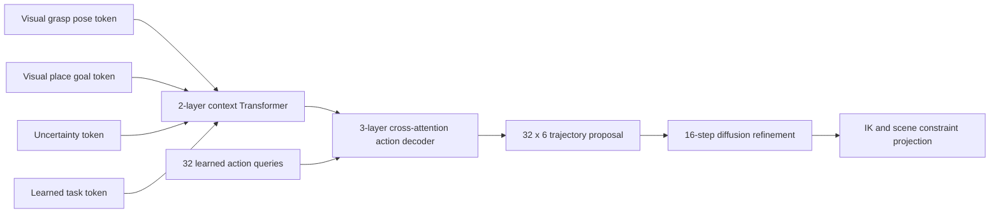

# Embodied Action-Chunk Transformer Digital Twin

## Objective

This experiment upgrades the XiaoU six-axis simulation from target-point planning to visual-conditioned **full-trajectory generation with constraint projection**. The objective is not to authorize physical movement. It tests whether an embodied action-chunk Transformer, coupled with explicit kinematic and scene constraints, can produce safer offline plan previews than an unconstrained generated trajectory.

## Model Design

### Counterfactual trajectory data

The generator samples grasp and placement joint configurations inside a conservative synthetic joint envelope. The checked-in POE model produces their end-effector poses. Quintic home-to-grasp-to-place-to-home trajectories are retained only when they pass the diagnostic TCP scene review.

For every retained trajectory, the visual input is perturbed by:

- target and placement position noise;
- target and placement yaw noise;
- detection confidence;
- declared sensor-noise scale.

The resulting input is a 21-dimensional visual context. The learning target is a normalized `32 x 6` joint trajectory, not a single action or terminal joint vector.

### Embodied Action-Chunk Transformer diffusion policy

The policy uses a tokenized context encoder and a cross-attention action decoder:

1. The observed visual grasp pose (9D position plus rotation-6D), visual place goal (9D), and uncertainty metadata (confidence, XY noise, yaw noise) are projected to three context tokens.
2. A learned task token is added, and a two-layer Transformer encoder fuses the four context tokens.
3. Thirty-two learned six-axis action queries cross-attend to the fused context through a three-layer Transformer decoder, predicting the full trajectory proposal.
4. During diffusion training/inference, noisy joint-state tokens with a timestep embedding use the same cross-attention decoder to predict denoising noise for the complete action chunk.

Training minimizes diffusion-noise MSE plus a weighted trajectory-proposal reconstruction loss. At inference, the reverse process starts from the learned action chunk plus controlled noise, then refines the full trajectory over 16 denoising steps. This preserves temporal structure and avoids treating arbitrary random joint-space noise as a usable robot action proposal.

The default `hidden_dim=96` checkpoint has 737,862 trainable parameters. The model is inspired by action chunking used in embodied policy research, but it consumes calibrated visual geometry instead of raw RGB, language tokens, or a pretrained VLM. It must therefore not be represented as a pretrained VLA system.



### Constraint projection and reject option

Each sampled trajectory is handled by a safety shield:

1. Compare the visual context with the normalized training support; unsupported contexts trigger `abstain`.
2. Measure multi-sample grasp-state dispersion; excessive uncertainty triggers `abstain`.
3. Use the generated grasp and place states as seeds for multi-start damped least-squares IK.
4. Rebuild the trajectory inside the assumed joint envelope and review TCP clearance against the table and configured fixture keep-out boxes.
5. Report a projected-safe preview or an explicit rejection reason. No result opens a hardware interface.

## Reproducible Experiment

The following run was executed on the local PyTorch CUDA environment:

| Split | Episodes | Visual noise |
| --- | ---: | --- |
| Train | 512 | XY 3 mm, Z 2 mm, yaw 2 deg |
| Nominal test | 128 | XY 3 mm, Z 2 mm, yaw 2 deg |
| Shift test | 128 | XY 8 mm, Z 4 mm, yaw 5 deg |

| Nominal metric | Result |
| --- | ---: |
| Unconstrained generated grasp endpoint error | 13.25 mm |
| Constraint-projected grasp endpoint error | 4.30 mm |
| Projected-safe coverage over all nominal episodes | 90.62% |
| Projection success after abstention | 91.34% |
| Shift-test OOD abstention | 100.00% |

The support-domain gate intentionally rejects the higher-noise shift set before projection. This is a safety result, not a performance claim: a real deployment must obtain a stable new observation or collect additional data before planning again.

## Run Commands

```powershell
powershell -ExecutionPolicy Bypass -File .\tools\run_constraint_diffusion.ps1
```

For a manual run, use a Python environment with compatible PyTorch, NumPy, and Matplotlib:

```powershell
D:\EmbodiedAI\mujoco-venv\Scripts\python.exe tools\constraint_diffusion_twin.py generate --output runtime\constraint_diffusion\train.npz --count 512 --seed 20260815
D:\EmbodiedAI\mujoco-venv\Scripts\python.exe tools\constraint_diffusion_twin.py train --dataset runtime\constraint_diffusion\train.npz --checkpoint runtime\constraint_diffusion\embodied_action_chunk_transformer_policy.pt --epochs 350 --batch-size 64 --hidden-dim 96 --diffusion-steps 16 --seed 20260815
D:\EmbodiedAI\mujoco-venv\Scripts\python.exe tools\constraint_diffusion_twin.py evaluate --checkpoint runtime\constraint_diffusion\embodied_action_chunk_transformer_policy.pt --dataset runtime\constraint_diffusion\test.npz --output runtime\constraint_diffusion\evaluation_nominal.json --samples-per-context 3 --abstain-dispersion-rad 0.45 --seed 20260815
```

## Limits

- The scene uses the checked-in POE model and synthetic visual noise; it is not a calibrated real-world simulator.
- Scene review is TCP-only. Full-link self-collision and CAD collision checking remain a ROS 2 / MoveIt task.
- The joint envelope, target height, and placement data are diagnostic assumptions until measured on the real arm.
- CAN IDs, encoder offsets, directions, feedback, emergency stop, and force/grasp feedback remain locked behind the existing hardware readiness gate.
